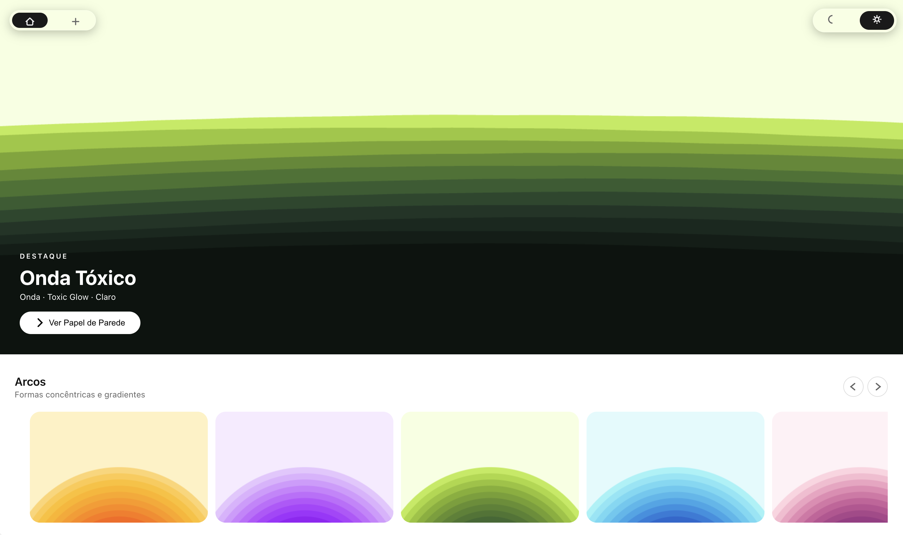
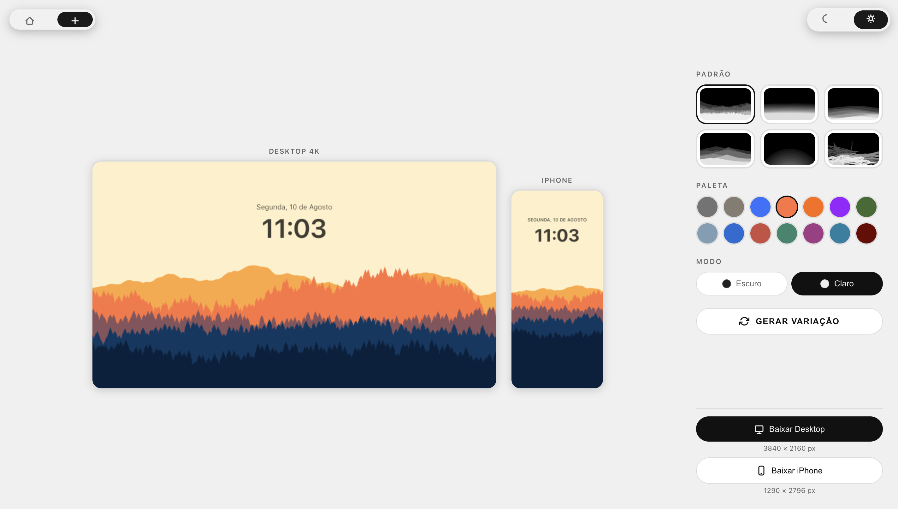

# WLLPR

### Free, unlimited 4K wallpapers generated entirely with code.

No AI. No tokens. No sign-up. No limits.

WLLPR generates abstract landscape wallpapers from scratch using procedural graphics. Choose a pattern, customize the palette and style, generate variations, and export a high-resolution PNG directly from your browser.

<p align="center">
  <a href="https://bypedroneres.github.io/wallpaper-generator/index.html">
    <strong>Browse Wallpapers</strong>
  </a>
  &nbsp;&nbsp;·&nbsp;&nbsp;
  <a href="https://bypedroneres.github.io/wallpaper-generator/create/index.html">
    <strong>Create Your Own</strong>
  </a>
</p>

---

## Preview

### Wallpaper Gallery

<p align="center">
  
</p>

Browse a collection of procedurally generated wallpapers organized by visual style. Every wallpaper is generated from a small set of parameters rather than stored as an image file.

### Create Your Own

<p align="center">
  
</p>

Use the editor to choose a pattern, palette, and theme, then generate unlimited variations with different seeds.

---

## Features

| | Feature | Description |
|---|---|---|
| ∞ | **Unlimited** | Generate as many wallpapers as you want. |
| 4K | **4K Export** | Export wallpapers at 3840 × 2160. |
| iPhone | **Mobile Export** | Export at 1290 × 2796 for iPhone. |
| AI | **No AI** | Every image is generated algorithmically in the browser. |
| 🔒 | **Private** | Nothing is uploaded to a server. |
| ⚡ | **Instant** | Rendering happens locally using HTML5 Canvas. |
| 🎨 | **13 Palettes** | Hand-tuned color palettes for every pattern. |
| 🌗 | **Light & Dark** | Every wallpaper supports both visual modes. |

---

## What Can You Create?

WLLPR currently includes **six procedural scene types**:

### Flowing Hills

Layered landscapes with rolling hills and scattered pine trees.

### Smooth Waves

Minimal, flowing compositions built from smooth curves.

### Sand Dunes

Abstract desert landscapes with layered sand formations.

### Jagged Mountains

Sharp mountain silhouettes with atmospheric depth.

### Concentric Arcs

Geometric compositions built from repeating curved forms.

### Desert Scribbles

Free-form desert landscapes created from organic procedural curves.

Each scene can be customized with:

- **13 color palettes**
- **Light and dark variants**
- **Randomized seeds**
- **Live previews**
- **macOS-style clock overlays**
- **4K desktop exports**
- **iPhone exports**

---

## How It Works

WLLPR does not store the wallpapers themselves.

Instead, each wallpaper is represented by a tiny **recipe**:

```js
{
  pattern,
  palette,
  seed,
  mode,
  id,
  name
}